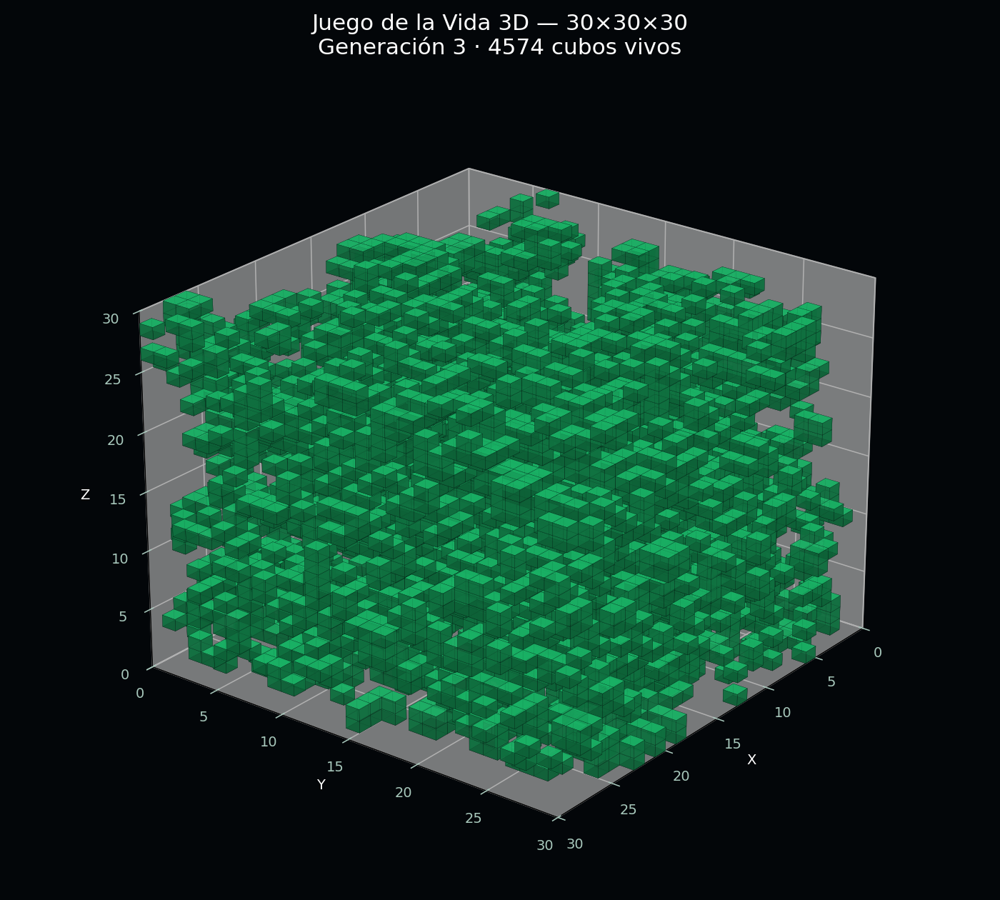

# Juego de la Vida 3D en Python

## Informe técnico, explicación y código completo

## 1. Resumen

Este proyecto implementa una variante tridimensional del **Juego de la Vida de Conway**. En lugar de utilizar un tablero bidimensional compuesto por celdas cuadradas, emplea un espacio cúbico de `30 × 30 × 30`, equivalente a **27.000 posiciones posibles**.

Cada posición del espacio contiene un cubo que puede encontrarse en uno de dos estados:

- **Vivo:** el valor almacenado es `True`.
- **Muerto:** el valor almacenado es `False`.

En cada generación se cuentan los cubos vivos que rodean a cada posición. Después se aplican reglas de nacimiento, supervivencia y muerte simultáneamente. El programa ofrece dos formas complementarias de observar el proceso:

1. Una proyección de profundidad dibujada directamente en la consola.
2. Una representación tridimensional interactiva generada con Matplotlib.

También puede guardar la evolución como una animación GIF mediante Pillow.

## 2. Vista previa

La siguiente imagen corresponde a la generación 3 de una simulación `30 × 30 × 30`, iniciada con una densidad de población de `0.05` y la semilla aleatoria `42`.



En esta imagen:

- Cada bloque verde representa un cubo vivo.
- Los espacios vacíos representan cubos muertos.
- Los ejes `X`, `Y` y `Z` muestran las tres dimensiones del mundo.
- La población mostrada es el resultado de aplicar tres generaciones completas.

## 3. Del Juego de la Vida clásico al modelo 3D

### 3.1 El modelo bidimensional original

En el Juego de la Vida clásico, cada celda de una matriz bidimensional tiene ocho vecinos: los cuatro laterales y los cuatro diagonales.

Las reglas clásicas se expresan habitualmente como `B3/S23`:

- `B3`: una celda muerta nace si tiene exactamente tres vecinos vivos.
- `S23`: una celda viva sobrevive si tiene dos o tres vecinos vivos.
- En cualquier otro caso, la celda muere o permanece muerta.

La letra `B` proviene de *Birth* —nacimiento— y la letra `S` de *Survival* —supervivencia—.

### 3.2 La ampliación a tres dimensiones

En el modelo tridimensional, una posición se identifica mediante tres coordenadas:

```text
(x, y, z)
```

Un cubo tiene como vecinos todas las posiciones cuyas coordenadas se encuentran a una distancia máxima de una unidad en cada eje. Esto forma un bloque local de `3 × 3 × 3`:

```text
3 × 3 × 3 = 27 posiciones
```

Una de esas posiciones es el propio cubo analizado, por lo que se excluye del conteo:

```text
27 - 1 = 26 vecinos
```

Por tanto, cada cubo interior puede tener entre 0 y 26 vecinos vivos.

### 3.3 Regla utilizada

Por defecto, el programa conserva literalmente la regla clásica `B3/S23`, pero la aplica sobre los 26 vecinos del espacio tridimensional:

- Un cubo muerto nace con exactamente 3 vecinos vivos.
- Un cubo vivo sobrevive con 2 o 3 vecinos vivos.
- En todos los demás casos queda muerto.

Esta es una traducción directa de las reglas de Conway. Sin embargo, la dinámica cambia considerablemente porque la cantidad posible de vecinos pasa de 8 a 26.

El programa también acepta otras reglas. Por ejemplo:

```text
B6/S5,6,7
```

Con esta regla, un cubo nace con 6 vecinos y sobrevive con 5, 6 o 7. Las reglas alternativas permiten buscar estructuras tridimensionales más estables.

## 4. Representación de los datos

El mundo se almacena en un arreglo booleano de NumPy:

```python
mundo = np.ndarray((30, 30, 30), dtype=bool)
```

Conceptualmente, puede accederse a un cubo de esta manera:

```python
mundo[x, y, z]
```

El uso de valores booleanos ofrece varias ventajas:

- Reduce el consumo de memoria.
- Permite operaciones vectorizadas.
- Hace que las condiciones de nacimiento y supervivencia sean claras.
- Convierte naturalmente `True` en 1 y `False` en 0 durante los conteos.

La función `crear_mundo()` genera la población inicial mediante números pseudoaleatorios. La densidad determina la probabilidad de que cada cubo comience vivo.

Con una densidad de `0.08`, aproximadamente el 8 % de las 27.000 posiciones comenzará vivo:

```text
27.000 × 0,08 ≈ 2.160 cubos vivos
```

## 5. Conteo de vecinos

La función `contar_vecinos()` recorre los 26 desplazamientos posibles alrededor de cada cubo.

Los desplazamientos de cada eje son:

```text
-1, 0, 1
```

La combinación `(0, 0, 0)` se omite porque representa la propia posición.

### 5.1 Bordes finitos

En el modo predeterminado, el espacio tiene límites. Más allá de las seis caras del cubo todos los valores se consideran muertos. Para conseguirlo se añade una capa de valores `False` alrededor de la matriz con `np.pad()`.

Este modelo se comporta como una caja cerrada:

- Los cubos de una cara tienen menos vecinos reales.
- Los cubos de las aristas tienen todavía menos.
- Los ocho cubos de las esquinas son los que menos vecinos poseen.

### 5.2 Espacio toroidal

Al utilizar `--toroidal`, las caras opuestas quedan conectadas. Un cubo que sale por el extremo derecho vuelve a entrar por el izquierdo; lo mismo ocurre en los ejes `Y` y `Z`.

Este comportamiento se implementa mediante `np.roll()` y evita bordes absolutos. Matemáticamente, el mundo se comporta como un espacio periódico tridimensional.

## 6. Actualización simultánea

Todos los cubos deben cambiar de estado simultáneamente. Modificar el mundo mientras se cuentan los vecinos produciría resultados incorrectos, porque algunos cubos se evaluarían con datos de la generación nueva y otros con datos de la anterior.

El programa evita ese problema creando una matriz nueva:

```python
nace = ~mundo & np.isin(vecinos, tuple(regla.nacen))
sobrevive = mundo & np.isin(vecinos, tuple(regla.sobreviven))
nuevo_mundo = nace | sobrevive
```

Primero se calculan todos los nacimientos y supervivencias; después se reemplaza la generación anterior.

## 7. Representación en la consola

Una terminal es bidimensional, por lo que no puede mostrar directamente el volumen completo. El programa resuelve esta limitación proyectando el eje `Z` sobre el plano `XY`.

Para cada coordenada `(x, y)` se cuenta cuántos cubos vivos existen a lo largo de la profundidad. El resultado se convierte en uno de los siguientes caracteres:

```text
 .:-=+*#%@
```

La interpretación es la siguiente:

- Un espacio significa que no hay cubos vivos en esa línea de profundidad.
- Los signos `.`, `:`, `-` y `=` representan densidades bajas o medias.
- Los caracteres `+`, `*`, `#`, `%` y `@` representan densidades progresivamente mayores.

Así se obtiene un mapa de profundidad compacto de `30 × 30` caracteres. La cabecera muestra además la generación, la población total y la regla activa.

## 8. Visualización gráfica

Matplotlib crea un sistema de ejes tridimensionales. El modo `voxeles` utiliza `Axes3D.voxels()` para dibujar cada posición viva como un cubo real.

```python
eje.voxels(
    mundo,
    facecolors="#20e080",
    edgecolors="#052e22",
    linewidth=0.18,
    alpha=0.82,
)
```

El modo `puntos` es una alternativa más rápida. Representa las posiciones vivas con marcadores cuadrados y resulta conveniente cuando hay miles de cubos o muchas generaciones.

La cámara cambia ligeramente su ángulo en cada generación:

```python
eje.view_init(elev=25, azim=35 + generacion * 0.6)
```

Esto produce una rotación lenta que ayuda a percibir la profundidad.

## 9. Requisitos e instalación

### 9.1 Requisitos

- Python 3.10 o posterior.
- NumPy.
- Matplotlib.
- Pillow, únicamente necesario para guardar GIF.

### 9.2 Instalación

Abra PowerShell, CMD o una terminal en la carpeta del proyecto y ejecute:

```bash
python -m pip install numpy matplotlib pillow
```

En algunos sistemas Linux puede ser necesario utilizar `python3`:

```bash
python3 -m pip install numpy matplotlib pillow
```

## 10. Formas de ejecución

### 10.1 Ejecución estándar

```bash
python juego_vida_3d.py
```

Utiliza un espacio `30 × 30 × 30`, 100 generaciones, una densidad inicial de `0.08` y la regla `B3/S23`.

### 10.2 Solamente en la consola

```bash
python juego_vida_3d.py --sin-gui
```

### 10.3 Simulación reproducible

```bash
python juego_vida_3d.py --semilla 42
```

Una semilla fija permite generar exactamente la misma población inicial en ejecuciones posteriores.

### 10.4 Espacio toroidal

```bash
python juego_vida_3d.py --toroidal
```

### 10.5 Regla tridimensional alternativa

```bash
python juego_vida_3d.py --regla B6/S5,6,7
```

### 10.6 Renderizado rápido con puntos

```bash
python juego_vida_3d.py --modo puntos
```

### 10.7 Exportación a GIF

```bash
python juego_vida_3d.py --generaciones 30 --modo puntos --guardar-gif vida3d.gif
```

El modo `puntos` es recomendable para exportaciones extensas. Dibujar varios miles de cubos con todas sus caras en cada cuadro puede consumir mucha memoria y tardar considerablemente.

## 11. Parámetros disponibles

| Parámetro | Valor predeterminado | Descripción |
|---|---:|---|
| `--tamano` | `30` | Longitud de cada lado del espacio cúbico. |
| `--generaciones` | `100` | Cantidad de generaciones que se calcularán. |
| `--densidad` | `0.08` | Probabilidad inicial de que un cubo esté vivo. |
| `--semilla` | Aleatoria | Semilla del generador pseudoaleatorio. |
| `--intervalo` | `180` | Tiempo entre cuadros, expresado en milisegundos. |
| `--regla` | `B3/S23` | Regla de nacimiento y supervivencia. |
| `--toroidal` | Desactivado | Conecta las caras opuestas del espacio. |
| `--modo` | `voxeles` | Selecciona `voxeles` o `puntos`. |
| `--sin-gui` | Desactivado | Ejecuta únicamente la representación de consola. |
| `--guardar-gif` | Ninguno | Guarda la animación en el archivo indicado. |
| `--repetir` | Desactivado | Repite la animación mientras la ventana permanece abierta. |

## 12. Código Python completo

Guarde el siguiente contenido con el nombre `juego_vida_3d.py`:

```python
#!/usr/bin/env python3
"""Juego de la Vida tridimensional para consola y visualización gráfica.

Dependencias:
    python -m pip install numpy matplotlib pillow

Ejemplo:
    python juego_vida_3d.py --generaciones 100 --densidad 0.08
    python juego_vida_3d.py --regla B6/S567 --guardar-gif vida3d.gif
"""

from __future__ import annotations

import argparse
import re
import sys
from dataclasses import dataclass
from pathlib import Path

import matplotlib.animation as animation
import matplotlib.pyplot as plt
import numpy as np


TAMANO = 30
ESCALA_PROFUNDIDAD = " .:-=+*#%@"


@dataclass(frozen=True)
class Regla:
    nacen: frozenset[int]
    sobreviven: frozenset[int]

    @classmethod
    def analizar(cls, texto: str) -> "Regla":
        coincidencia = re.fullmatch(r"B([0-9,]*)/S([0-9,]*)", texto.upper())
        if not coincidencia:
            raise argparse.ArgumentTypeError(
                "La regla debe tener el formato B3/S23 o B6/S5,6,7"
            )

        def convertir(grupo: str) -> frozenset[int]:
            if not grupo:
                return frozenset()
            if "," in grupo:
                valores = (int(n) for n in grupo.split(","))
            else:
                valores = (int(n) for n in grupo)
            resultado = frozenset(valores)
            if any(n < 0 or n > 26 for n in resultado):
                raise argparse.ArgumentTypeError(
                    "En 3D, la cantidad de vecinos debe estar entre 0 y 26"
                )
            return resultado

        return cls(convertir(coincidencia.group(1)), convertir(coincidencia.group(2)))


def crear_mundo(tamano: int, densidad: float, semilla: int | None) -> np.ndarray:
    """Crea un mundo booleano [x, y, z] con población aleatoria."""
    rng = np.random.default_rng(semilla)
    return rng.random((tamano, tamano, tamano)) < densidad


def contar_vecinos(mundo: np.ndarray, toroidal: bool) -> np.ndarray:
    """Cuenta los 26 vecinos de cada cubo sin usar SciPy."""
    vecinos = np.zeros(mundo.shape, dtype=np.uint8)

    if toroidal:
        for dx in (-1, 0, 1):
            for dy in (-1, 0, 1):
                for dz in (-1, 0, 1):
                    if dx == dy == dz == 0:
                        continue
                    vecinos += np.roll(mundo, (dx, dy, dz), axis=(0, 1, 2))
        return vecinos

    acolchado = np.pad(mundo, 1, mode="constant", constant_values=False)
    sx, sy, sz = mundo.shape
    for dx in range(3):
        for dy in range(3):
            for dz in range(3):
                if dx == dy == dz == 1:
                    continue
                vecinos += acolchado[dx : dx + sx, dy : dy + sy, dz : dz + sz]
    return vecinos


def evolucionar(mundo: np.ndarray, regla: Regla, toroidal: bool) -> np.ndarray:
    """Calcula simultáneamente la siguiente generación."""
    vecinos = contar_vecinos(mundo, toroidal)
    nace = ~mundo & np.isin(vecinos, tuple(regla.nacen))
    sobrevive = mundo & np.isin(vecinos, tuple(regla.sobreviven))
    return nace | sobrevive


def proyeccion_consola(mundo: np.ndarray) -> list[str]:
    """Proyecta el eje Z: un carácter más intenso indica más cubos vivos."""
    profundidad = mundo.sum(axis=2)
    maximo = max(1, int(profundidad.max()))
    indices = np.rint(
        profundidad * (len(ESCALA_PROFUNDIDAD) - 1) / maximo
    ).astype(int)
    return ["".join(ESCALA_PROFUNDIDAD[i] for i in fila) for fila in indices]


def mostrar_consola(mundo: np.ndarray, generacion: int, regla_texto: str) -> None:
    """Dibuja una proyección XY de 30x30 en la terminal."""
    if sys.stdout.isatty():
        print("\033[2J\033[H", end="")
    print(
        f"Juego de la Vida 3D | generación {generacion:04d} | "
        f"vivos: {int(mundo.sum()):5d} | regla {regla_texto}"
    )
    print("Proyección XY (brillo = cantidad de cubos vivos a lo largo de Z)")
    print("┌" + "─" * mundo.shape[0] + "┐")
    for fila in proyeccion_consola(mundo):
        print("│" + fila + "│")
    print("└" + "─" * mundo.shape[0] + "┘", flush=True)


class Simulacion3D:
    def __init__(self, args: argparse.Namespace) -> None:
        self.args = args
        self.regla = Regla.analizar(args.regla)
        self.mundo = crear_mundo(args.tamano, args.densidad, args.semilla)
        self.mundo_inicial = self.mundo.copy()
        self.generacion = 0

    def avanzar(self) -> None:
        self.mundo = evolucionar(self.mundo, self.regla, self.args.toroidal)
        self.generacion += 1

    def ejecutar_solo_consola(self) -> None:
        for paso in range(self.args.generaciones + 1):
            mostrar_consola(self.mundo, self.generacion, self.args.regla)
            if paso < self.args.generaciones:
                plt.pause(self.args.intervalo / 1000)
                self.avanzar()

    def crear_animacion(self) -> tuple[plt.Figure, animation.FuncAnimation]:
        figura = plt.figure(figsize=(9, 8))
        eje = figura.add_subplot(111, projection="3d")
        figura.patch.set_facecolor("#05070a")

        def dibujar(frame: int) -> list:
            if frame < self.generacion:
                self.mundo = self.mundo_inicial.copy()
                self.generacion = 0
            while self.generacion < frame:
                self.avanzar()

            eje.clear()
            eje.set_facecolor("#05070a")
            mostrar_consola(self.mundo, self.generacion, self.args.regla)

            if self.args.modo == "voxeles":
                artistas = eje.voxels(
                    self.mundo,
                    facecolors="#20e080",
                    edgecolors="#052e22",
                    linewidth=0.18,
                    alpha=0.82,
                )
                resultado = list(artistas.values())
            else:
                x, y, z = np.nonzero(self.mundo)
                puntos = eje.scatter(
                    x, y, z, c=z, cmap="viridis", marker="s", s=19, alpha=0.85
                )
                resultado = [puntos]

            limite = self.args.tamano
            eje.set(xlim=(0, limite), ylim=(0, limite), zlim=(0, limite))
            eje.set_xlabel("X", color="white")
            eje.set_ylabel("Y", color="white")
            eje.set_zlabel("Z", color="white")
            eje.set_title(
                f"Juego de la Vida 3D — generación {self.generacion} — "
                f"{int(self.mundo.sum())} vivos",
                color="white",
                pad=18,
            )
            eje.tick_params(colors="#9eb7ad")
            eje.view_init(elev=25, azim=35 + self.generacion * 0.6)
            figura.tight_layout()

            return resultado

        animacion = animation.FuncAnimation(
            figura,
            dibujar,
            frames=self.args.generaciones + 1,
            interval=self.args.intervalo,
            blit=False,
            repeat=self.args.repetir,
            cache_frame_data=False,
        )
        return figura, animacion

    def ejecutar(self) -> None:
        if self.args.sin_gui:
            self.ejecutar_solo_consola()
            return

        figura, animacion_3d = self.crear_animacion()
        if self.args.guardar_gif:
            destino = Path(self.args.guardar_gif).expanduser().resolve()
            print(f"Generando GIF: {destino}")
            animacion_3d.save(
                destino,
                writer=animation.PillowWriter(fps=max(1, 1000 // self.args.intervalo)),
                dpi=90,
            )
            print("GIF generado correctamente.")
        else:
            plt.show()
        plt.close(figura)


def porcentaje(texto: str) -> float:
    valor = float(texto)
    if not 0.0 <= valor <= 1.0:
        raise argparse.ArgumentTypeError("La densidad debe estar entre 0 y 1")
    return valor


def crear_argumentos() -> argparse.ArgumentParser:
    parser = argparse.ArgumentParser(
        description="Juego de la Vida en una matriz cúbica de 30×30×30."
    )
    parser.add_argument("--tamano", type=int, default=TAMANO)
    parser.add_argument("--generaciones", type=int, default=100)
    parser.add_argument("--densidad", type=porcentaje, default=0.08)
    parser.add_argument("--semilla", type=int, default=None)
    parser.add_argument("--intervalo", type=int, default=180, help="Milisegundos")
    parser.add_argument(
        "--regla",
        default="B3/S23",
        help="B3/S23 conserva las reglas clásicas; ejemplo 3D: B6/S5,6,7",
    )
    parser.add_argument(
        "--toroidal", action="store_true", help="Conecta las caras opuestas del cubo"
    )
    parser.add_argument(
        "--modo", choices=("voxeles", "puntos"), default="voxeles"
    )
    parser.add_argument("--sin-gui", action="store_true")
    parser.add_argument("--guardar-gif", metavar="ARCHIVO.gif")
    parser.add_argument("--repetir", action="store_true")
    return parser


def main() -> None:
    args = crear_argumentos().parse_args()
    if args.tamano < 3:
        raise SystemExit("--tamano debe ser 3 o mayor")
    if args.generaciones < 0 or args.intervalo < 1:
        raise SystemExit("Generaciones e intervalo deben ser valores válidos")
    try:
        Regla.analizar(args.regla)
    except argparse.ArgumentTypeError as error:
        raise SystemExit(str(error)) from error
    Simulacion3D(args).ejecutar()


if __name__ == "__main__":
    main()
```

## 13. Explicación de los componentes principales

### 13.1 Clase `Regla`

La clase inmutable `Regla` almacena dos conjuntos:

- `nacen`: cantidades de vecinos que producen un nacimiento.
- `sobreviven`: cantidades de vecinos que permiten la supervivencia.

El método `analizar()` convierte textos como `B3/S23` o `B6/S5,6,7` en conjuntos de enteros y rechaza valores fuera del intervalo de 0 a 26.

### 13.2 Función `crear_mundo()`

Crea un arreglo cúbico con la dimensión elegida. Cada posición se compara con la densidad indicada. Si el número aleatorio es menor que esa densidad, el cubo comienza vivo.

### 13.3 Función `contar_vecinos()`

Suma 26 versiones desplazadas del mundo. Puede trabajar con bordes finitos mediante una matriz acolchada o con bordes periódicos mediante `np.roll()`.

### 13.4 Función `evolucionar()`

Aplica simultáneamente las condiciones de nacimiento y supervivencia. Devuelve una nueva matriz booleana sin modificar la generación de entrada.

### 13.5 Funciones de consola

`proyeccion_consola()` reduce el eje `Z` y transforma los valores numéricos en caracteres de intensidad. `mostrar_consola()` añade el marco, la cabecera y la limpieza de pantalla mediante secuencias ANSI.

### 13.6 Clase `Simulacion3D`

Mantiene el estado actual, la generación, la regla y los parámetros. También coordina:

- El avance temporal.
- La salida exclusiva por consola.
- La creación de la animación.
- El renderizado de vóxeles o puntos.
- La exportación mediante Pillow.
- El reinicio cuando se repite la animación.

### 13.7 Función `crear_argumentos()`

Define la interfaz de línea de comandos con `argparse`. Esto permite cambiar el comportamiento sin editar el código fuente.

## 14. Complejidad y rendimiento

Para un mundo de lado `N`, la cantidad total de posiciones es:

```text
N³
```

El conteo realiza 26 sumas sobre arreglos completos. Como 26 es una constante, la complejidad temporal por generación puede expresarse como:

```text
O(N³)
```

Para `N = 30`, cada generación analiza 27.000 posiciones. NumPy ejecuta las operaciones en código compilado y evita un bucle de Python por cada cubo, por lo que el cálculo lógico es relativamente rápido.

La parte más costosa suele ser el renderizado gráfico:

- `voxeles` dibuja caras tridimensionales y ofrece mayor fidelidad visual.
- `puntos` consume menos memoria y es más adecuado para animaciones largas.
- Una densidad elevada produce más objetos visibles y aumenta el tiempo de dibujo.
- Exportar GIF requiere renderizar y comprimir todas las generaciones.

## 15. Consideraciones sobre las reglas

No existe una única extensión canónica del Juego de la Vida a tres dimensiones. Mantener `B3/S23` satisface la idea de conservar las mismas condiciones, pero no garantiza los mismos tipos de patrones que aparecen en dos dimensiones.

El programa separa la regla del motor precisamente para facilitar la experimentación. Algunos ejemplos válidos son:

```bash
python juego_vida_3d.py --regla B3/S23
python juego_vida_3d.py --regla B6/S5,6,7
python juego_vida_3d.py --regla B5/S4,5
```

Las comas son necesarias cuando una cantidad tiene más de una cifra o cuando se desea evitar ambigüedad. Por ejemplo, `S5,6,7` expresa claramente tres valores independientes.

## 16. Solución de problemas

### La ventana gráfica no aparece

Compruebe que Matplotlib esté instalado y que el sistema tenga un entorno gráfico disponible:

```bash
python -m pip install --upgrade matplotlib
```

En un servidor sin escritorio, utilice:

```bash
python juego_vida_3d.py --sin-gui
```

### La animación funciona lentamente

Cambie a la representación de puntos, reduzca el tamaño o disminuya la cantidad de generaciones:

```bash
python juego_vida_3d.py --modo puntos --tamano 20 --generaciones 40
```

### El GIF consume demasiada memoria

Utilice el modo `puntos`, aumente el intervalo o reduzca las generaciones:

```bash
python juego_vida_3d.py --modo puntos --generaciones 20 --intervalo 300 --guardar-gif vida3d.gif
```

### La consola muestra símbolos incorrectos

Utilice una terminal compatible con UTF-8. En Windows se recomienda Windows Terminal o PowerShell moderno.

### La población cambia cada vez

Eso es normal cuando no se proporciona una semilla. Para repetir exactamente el mismo experimento:

```bash
python juego_vida_3d.py --semilla 42
```

## 17. Posibles ampliaciones

El proyecto puede evolucionar en varias direcciones:

1. Permitir colocar patrones iniciales mediante archivos JSON o NumPy.
2. Guardar y restaurar generaciones completas.
3. Mostrar cortes independientes de los planos `XY`, `XZ` y `YZ`.
4. Añadir controles de pausa, avance y retroceso.
5. Incorporar una interfaz gráfica para editar cubos con el ratón.
6. Comparar varias reglas en paralelo.
7. Registrar población, nacimientos y muertes en archivos CSV.
8. Generar gráficos estadísticos de la evolución.
9. Acelerar el cálculo mediante Numba, CuPy o procesamiento en GPU.
10. Exportar el volumen a formatos compatibles con software 3D.

## 18. Conclusión

Esta implementación conserva la esencia del Juego de la Vida: reglas locales sencillas producen un comportamiento global complejo. La tercera dimensión amplía cada vecindario de 8 a 26 posiciones y transforma el tablero en un autómata celular volumétrico.

El uso combinado de NumPy, Matplotlib y Pillow permite separar claramente tres responsabilidades:

- NumPy administra el estado y calcula las generaciones.
- La consola ofrece una representación ligera mediante una proyección de profundidad.
- Matplotlib y Pillow proporcionan visualización tridimensional y exportación animada.

El resultado es un proyecto educativo, configurable y extensible que puede utilizarse para estudiar autómatas celulares, programación científica, visualización de datos y optimización de algoritmos tridimensionales.
